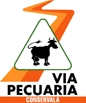
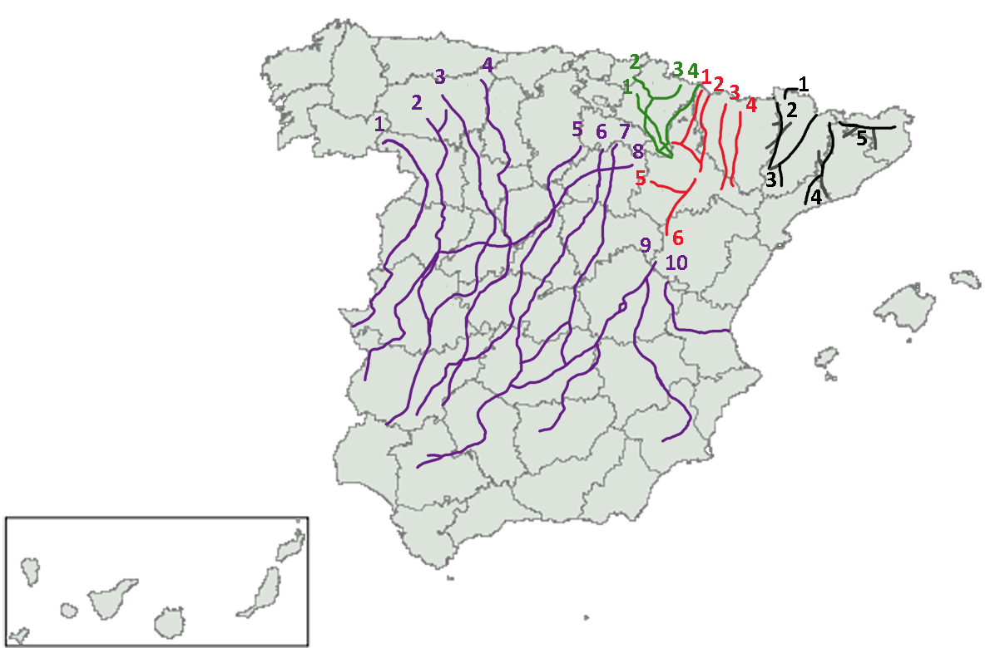

# Cañadas Reales, Open Street Map

Proyecto para la recuperación de las Cañadas Reales de España via mappeo y registro de las posiciones en un formato abierto.

El actual proyecto se está manteniendo con Umap y gracias al server de umap.openstreetmap.fr

El link para consultar el mapa actual es:

http://umap.openstreetmap.fr/es/map/canadas-reales_518716#7/39.610/-1.967

## Intro

El objetivo de este proyecto es catalogar y mantener las rutas de las Cañadas Reales, España posee las siguientes Cañadas Reales:

1. Cañada Real Zamorana. 
2. Cañada Real Vizana o de la Plata
3. Cañada Real Leonesa Occidental 
4. Cañada Real Leonesa Oriental
5. Cañada Real Segoviana
6. Cañada Real Galiana (Riojana)
7. Cañada Real Soriana Oriental
8. Cañada Real Soriana Occidental
9. Cañada Real Conquense
10. Cañada Real del Reino de Valencia

                

**Definición en Wikipedia**
> Se denominan cañadas reales a aquellas cañadas de uso tradicional en la trashumancia en España, reguladas por edicto real de Alfonso X el Sabio en 1273. Si bien los caminos trazados por las cañadas luego conocidas como reales eran recorridos usados desde el antiguo por el pastoreo trashumante, el decreto de Alfonso X perseguía la regulación, ordenación y protección de ciertos caminos que por su importancia, uso o ubicación merecían ser preservados de posibles violaciones. Así, junto con la creación del Concejo de la Mesta, quedaron definidas las cañadas reales."

### Motivaciones

Las Cañadas Reales es un recurso importante de nuestro país, el cual se está abandonando por el propio deshuso del pastoreo de transumancia, así como por la dejadez de las administraciones locales y generales, en ocasiones justificando el bien común como un elemento para eliminar o destruir parte del legado, abandonando su mantenimiento o incluso olvidándolo.

No somos conscientes que parte de estos recursos pueden ser utilizados como reclamo turístico, y si bien hay otros elementos como Vias Verdes (reutilización de antiguas vías ferreas), el conjunto de las Vias Pecurias y en especial las Cañadas Reales, deberían tener una distinción muy importante.

## Catálago de mapas 

Actualmente se encuentra geoposicionada la siguientes rutas en Umap:

| Cañada       | % Completada     | 
| :------------- | :----------: | 
|  Cañada Real Segoviana | 80%   | 

## Visualización 
### UMAP - consulta y edición 

Umap es un proyecto de código abierto donde se pueden editar y contruir capas especificas para compartir mapas. El proyecto original se puede encontrar en: https://github.com/umap-project/umap

Visualización del Mapa con datos de la Cañadas Reales, en:
http://umap.openstreetmap.fr/es/map/canadas-reales_518716

Estos mapas pueden ser editados y solicitadas las modificaciones oportunas, asi como la adición de datos que permitan un enriquecimiento de la información para todos los usuarios.

### Web App - Custom
El proyecto contiene un visualización custom de los datos en vez de usar Umap para futuras implementaciones o diseños que se realicen sobre la visualización de datos.

La PWA (progressive web app), esta desarrollada con:
- React Leaflet
- MapBox
- Gatbsy para el render estático

#### Instalación y uso

El proyecto se ha realizado con Gatsby React LeaftLet, es necesario tener instalado NodeJS, Yarn o npx. 
Gatsby React LeaftLet construye un site estatico con los componentes necesarios de React, React Dom, Header, LeafLet para el procesamiento de mapas.
Más info en: https://www.colbyfayock.com/2020/03/anyone-can-map-inspiration-and-an-introduction-to-the-world-of-mapping

1.- Clona el proyecto
2.- Accede a webapp
3.- Ejecuta el comando npm start

#### Desarrollo

React Leaflet
https://react-leaflet.js.org/docs/start-installation

## Fuentes de recopilación de datos

Wikiloc y Strava han servido como fuente de obtención de geodata para recopilar información sobre las vias pecuarias, sobre todo en aquellos puntos donde se pierde la línea por obras o cruces con vias.

https://es.wikiloc.com/rutas-mountain-bike/circular-a-cerceda-24931683

https://www.strava.com/activities/1419235036

https://ireneses.wordpress.com/2012/08/16/redes-canadas-reales/

## Contribución

La constribución de este proyecto es totalmente abierta, siendo aceptadas peticiones de cambio.

Puedes contribuir en este proyecto de las siguientes formas:

- Geoposición de las Cañadas en Umap. Puedes añadir un nueva ruta al mapa actual de Umap, solicitando una revisión posterior a la modificación del mapa.
- Añadir PDI intersantes de las rutas.
- Añadir comentarios y fotos
- Añadir movimientos actuales de ganaderia y uso.

Para todas las contribuciones, se solicitara una revisión con un "Pull Request" de las posiciones actualizadas sobre el mapa original.

